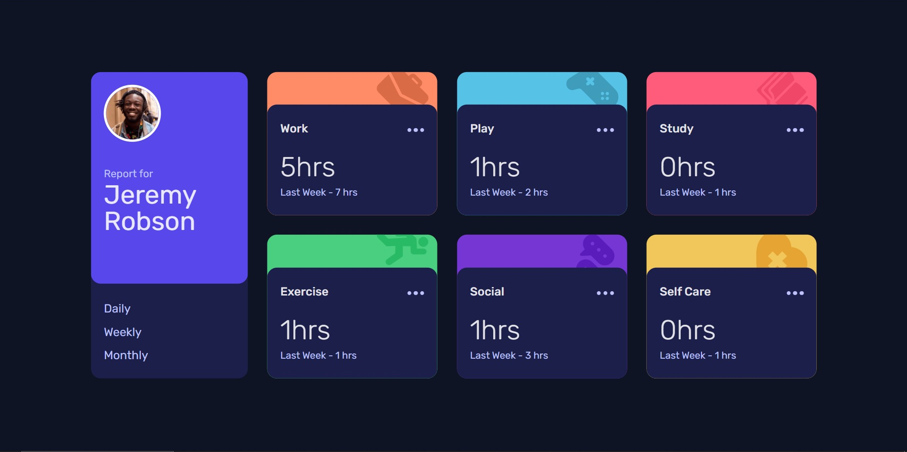
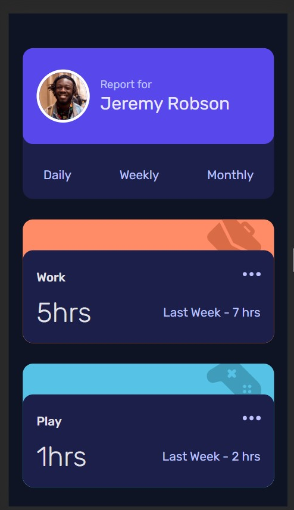

# Frontend Mentor - Time tracking dashboard solution

This is a solution to the [Time tracking dashboard challenge on Frontend Mentor](https://www.frontendmentor.io/challenges/time-tracking-dashboard-UIQ7167Jw). Frontend Mentor challenges help you improve your coding skills by building realistic projects.

# This is my first react app

## Table of contents

- [Overview](#overview)

  - [Screenshot](#screenshot)
  - [Built with](#built-with)
  - [Links](#links)

- [What I learned](#what-i-learned)
  - [Continued development](#continued-development)
- [Author](#author)

## Overview

### Screenshot

### Built with

- Semantic HTML5 markup
- CSS custom properties
- Flexbox
- CSS Grid
- Mobile-first workflow
- [React](https://reactjs.org/) - JS library
- [Styled Components](https://styled-components.com/) - For styles

### Links

- Solution URL: [Url-to-solution-page](https://github.com/breeMudi/time-tracking)
- Live Site URL: [Visit Live Url](https://breemudi.github.io/time-tracking/)

## What i have learnt so far

- how to use props to pass in values to components -in this case: folders- so as to pass in attributes (such as: background color, variable values) when the folder is rendered in the app.

- it is worth noting that, after introducing props to a react function, we must define its prop TYPE with the following code:

functionName.propTypes = String ...If it is going to be a string

---

Now, we have leart about useRef and useEffect hooks, the next problem is, how do we tell the app to display Daily or Weekly or Monthly statistics dynamically ?

> Apparently, in react, props can only be passed from parent to child folder.

meaning that, if a child component were to change as a result of a click, whatever property you save as a state in that component can not be accessed or changed or can not make any difference to the parent component in which it is placed.

Due to this: One will wonder, is it not possible to pass the changed variable as a value to any component in the react app...

Turns out that this is indeed possible. thanx to _Arthur Schmaro_ On Youtube [HisVideo] (https://www.youtube.com/watch?v=3YKlDXqX9r8)

> With his method, I was able to set global state variables that can be updated and used from any component in the react app.

To see how this was implemented: Go to the [HeroComponent](https://github.com/breeMudi/time-tracking/blob/main/src/components/HeroFolder.jsx)

### Continued development

This project could do with a few animations on the background image in each of the event folders. This can be made smoothly with gsap.

3d effects somebody?

## Author

- Frontend Mentor - [@breeMudi](https://www.frontendmentor.io/profile/breeMudi)

- Twitter - [@Bridgetmudiaga](https://www.twitter.com/Bridgetmudiaga)

- Website - [Bridget](https://www.breemudi.com)
